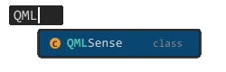
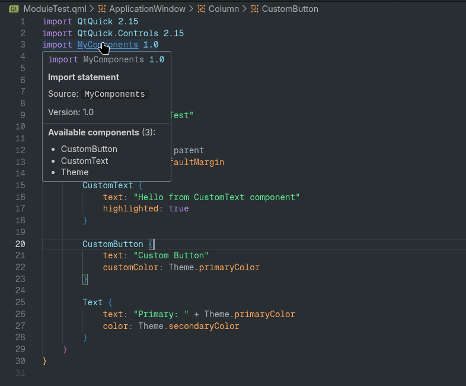

<p align="center"></p>

<p align="center"><b>QML language support for VS Code</b></p>

<p align="center">
  <a href="https://github.com/LordTermor/QMLSense/releases/latest">
    
  </a>
  <a href="LICENSE">
    
  </a>
</p>

---

<p align="center">
  
</p>

## Features

- TextMate grammar for `.qml` and `.qmldir` files
- Semantic-based highlighting
- Smart selection (Ctrl+Alt+Left/Right)
- Go to definition
- Find references
- Autocompletion
- Hover information
- VSCode problems integration (syntax errors)

### Module Index

QMLSense provides an SQLite-based module index for multi-file references and definitions. It allows to navigate through:

- Components from qmldir modules
- Components from the same folder

Known limitation: It works only with qmldir modules no CMake or C++-based components support at the moment.

## Installation

Use a .vsix file from GitHub release. VSCode Marketplace is coming soon.

## Known Issues

- Autocompletion doesn't include property suggestions from base types
- No CMake or C++-based component support

## Contributing

Any help (bug reporting or PRs) is very welcome!

To build an extension, use `build.sh` script. You'll need Docker and npm (or other Node.js package manager).
```sh
$ ./build.sh
```

This measure is needed to ensure sqlite uses supported glibc version.

To have project set up for local development:
```sh
$ npm install
$ npm run compile
```

You can use `F5` in Visual Studio Code to debug the extension.

## License

The software is licensed under GPLv3.
